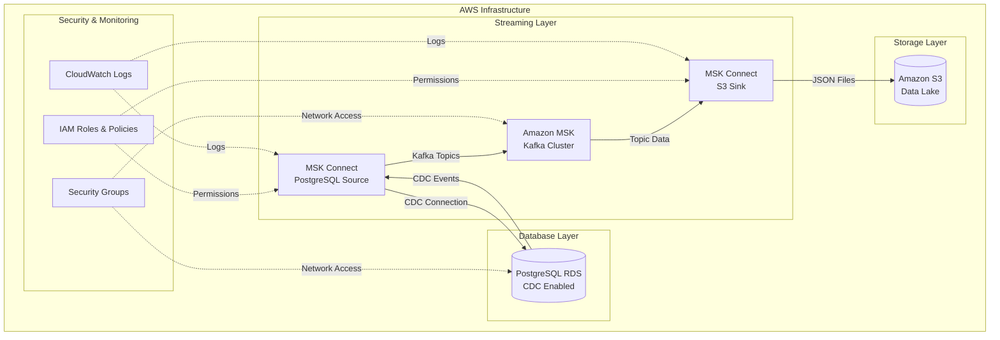
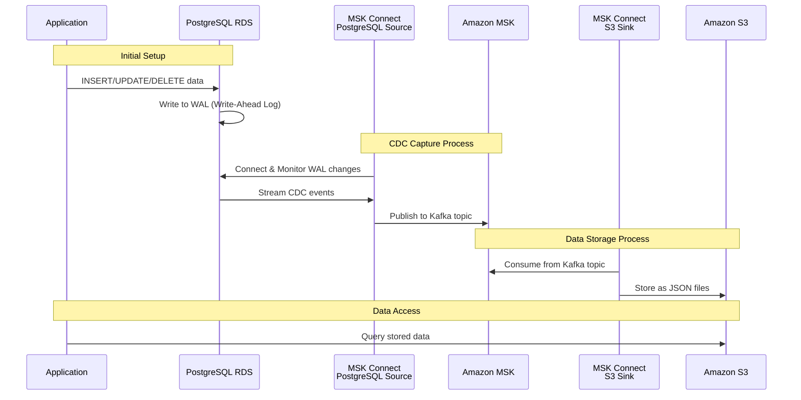
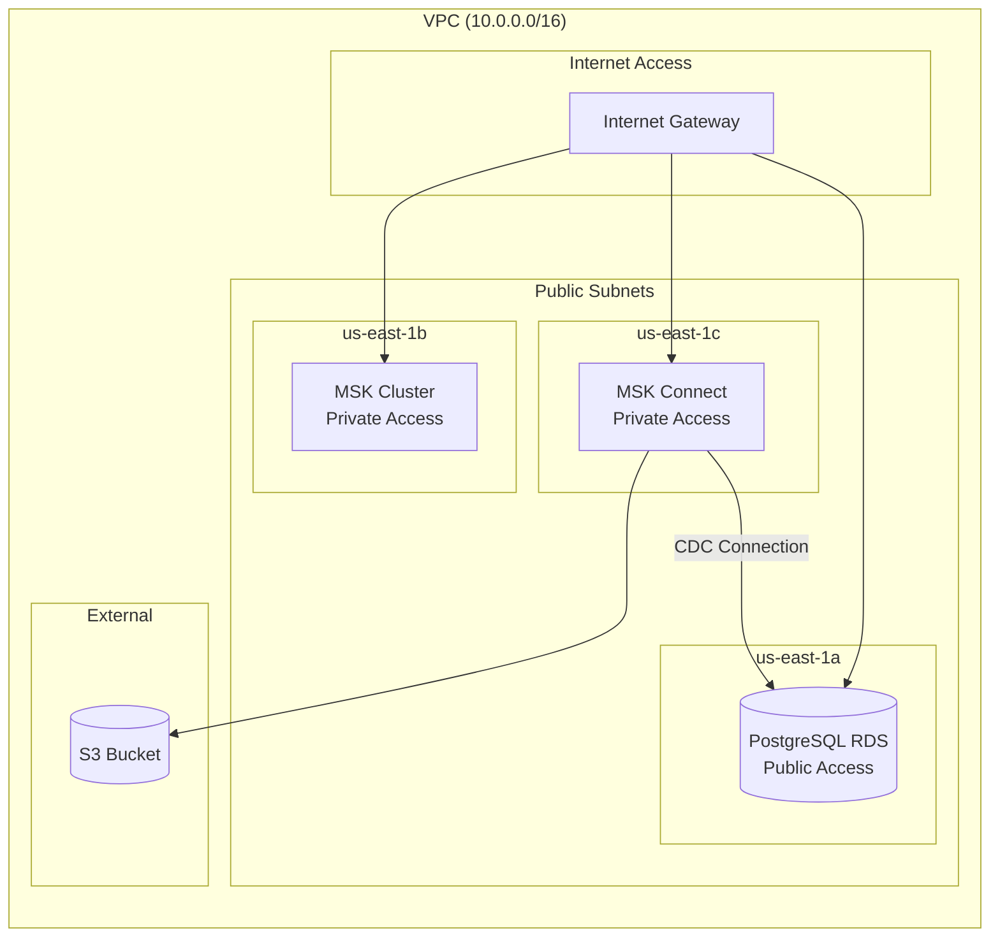
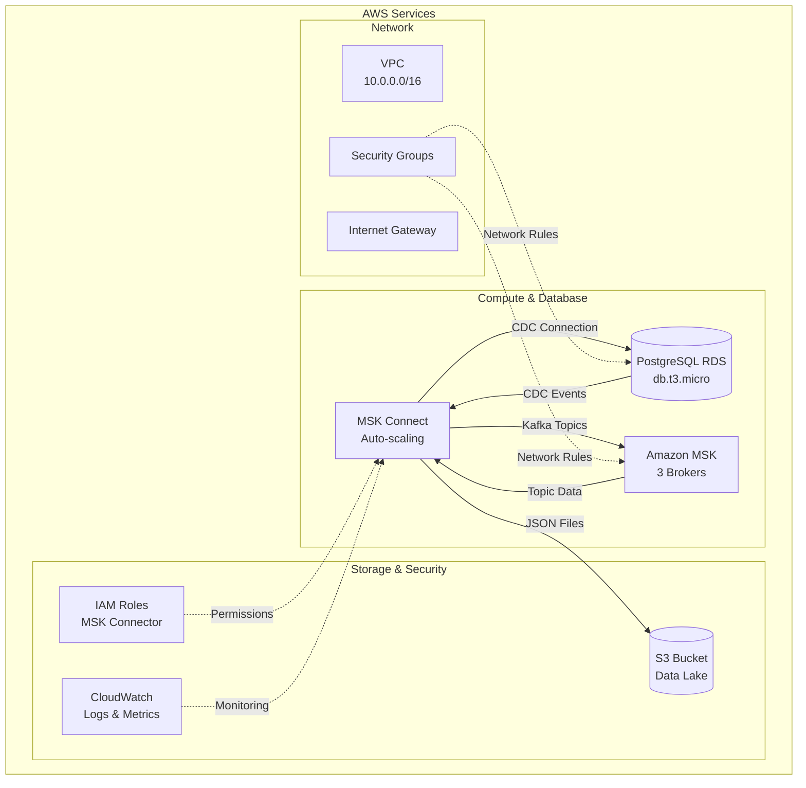

# PostgreSQL RDS (CDC) → MSK → S3 Data Pipeline

This demo lab demonstrates a complete data pipeline that captures Change Data Capture (CDC) events from PostgreSQL RDS, streams them through Amazon MSK (Managed Streaming for Apache Kafka), and stores the data in Amazon S3.

## Architecture Overview



## Data Flow Diagram



## Network Infrastructure



## Infrastructure Components



## Prerequisites

- AWS CLI configured with appropriate permissions
- Terraform/OpenTofu installed
- PostgreSQL client tools (psql)

## Deployment

### 1. Configure AWS Access

Ensure your AWS credentials are configured in `~/.aws/credentials`:

```bash
# Get your public IP for security group configuration
curl ifconfig.io
```

### 2. Initialize and Deploy Infrastructure

```bash
# Navigate to the tofu directory
cd tofu

# Initialize OpenTofu
tofu init

# Plan the deployment
tofu plan

# Apply the infrastructure
tofu apply
```

### 3. Download Required Connectors

Before deployment, download the required Kafka Connect plugins:

- **Debezium PostgreSQL CDC Source Connector v2.3.7**: [Download](https://hub-downloads.confluent.io/api/plugins/debezium/debezium-connector-postgresql/versions/2.3.7.Final/debezium-debezium-connector-postgresql-2.3.7.Final.zip)
- **Amazon S3 Sink Connector v10.6.7**: [Download](https://hub-downloads.confluent.io/api/plugins/confluentinc/kafka-connect-s3/versions/10.6.7/confluentinc-kafka-connect-s3-10.6.7.zip)

Place these files in the `connectors/` directory.

## Database Setup

### Connect to PostgreSQL RDS

```bash
# Get RDS endpoint
export RDS_HOST=$(tofu -chdir=tofu output -json rds | jq -r '.endpoint' | cut -d':' -f1)
export PGPASSWORD=msk_password

# Connect to database
psql -U msk_user -h $RDS_HOST msk_db
```

### Verify CDC Configuration

```sql
-- Verify CDC settings
SELECT name, setting FROM pg_settings
WHERE name IN ('wal_level', 'rds.logical_replication', 'max_replication_slots');

-- Verify user privileges
SELECT rolname, rolreplication FROM pg_roles
WHERE rolname = 'msk_user';

-- Test replication slot creation
SELECT * FROM pg_create_logical_replication_slot('test_slot', 'pgoutput');
```

### Setup Database Schema

```sql
-- Create sample table
CREATE TABLE student (
    id SERIAL PRIMARY KEY,
    name VARCHAR(100)
);

-- Configure for CDC (enables before-image capture for UPDATEs)
ALTER TABLE public.student REPLICA IDENTITY FULL;

-- Grant necessary permissions
GRANT USAGE ON SCHEMA public TO msk_user;
GRANT SELECT ON ALL TABLES IN SCHEMA public TO msk_user;
ALTER DEFAULT PRIVILEGES IN SCHEMA public GRANT SELECT ON TABLES TO msk_user;
GRANT rds_replication TO msk_user;
```

### Test CDC Functionality

```sql
-- Insert test data
INSERT INTO student (name) VALUES ('John Doe'), ('Jane Smith');

-- Update data (CDC will capture before and after images)
UPDATE student SET name = 'Updated Name' WHERE id = 1;

-- Delete data
DELETE FROM student WHERE id = 2;

-- Insert bulk data for testing
INSERT INTO student (name)
SELECT 'Student ' || generate_series(1, 10);
```

## Monitoring and Troubleshooting

### Check Replication Status

```sql
-- Monitor replication slots
SELECT slot_name, plugin, slot_type, database, active
FROM pg_replication_slots;

-- Check publications
SELECT * FROM pg_publication;
SELECT * FROM pg_publication_tables;
```

### MSK Connect Monitoring

- **CloudWatch Logs**: Check connector logs in CloudWatch
- **MSK Console**: Monitor connector status and metrics
- **S3 Bucket**: Verify data files are being written

### Common Issues

1. **CDC Not Working**: Ensure `rds.logical_replication = 1` in parameter group
2. **Permission Errors**: Verify IAM roles and security group rules
3. **Network Issues**: Check VPC endpoints and routing

## Data Flow Verification

### 1. Check Kafka Topics

```bash
# Get MSK bootstrap servers
export MSK_BOOTSTRAP=$(tofu -chdir=tofu output -raw msk_cluster_bootstrap_brokers_sasl_iam)

# List topics (requires Kafka tools)
kafka-topics --bootstrap-server $MSK_BOOTSTRAP --list
```

### 2. Verify S3 Data

```bash
# List S3 bucket contents
aws s3 ls s3://$(tofu -chdir=tofu output -raw s3_bucket_name)/

# Check for JSON files
aws s3 ls s3://$(tofu -chdir=tofu output -raw s3_bucket_name)/ --recursive
```

## Cleanup

```bash
# Destroy infrastructure
tofu -chdir=tofu destroy

# Clean up replication slots (if needed)
psql -U msk_user -h $RDS_HOST msk_db -c "SELECT pg_drop_replication_slot('debezium');"
```

## Security Considerations

⚠️ **Important**: This is a demo environment. For production use:

- Change all default passwords
- Use AWS Secrets Manager for sensitive data
- Implement proper IAM roles with least privilege
- Enable encryption at rest and in transit
- Configure proper VPC security groups
- Use private subnets for production workloads

## Architecture Benefits

- **Real-time Data Streaming**: Capture database changes as they happen
- **Scalable Infrastructure**: MSK handles high-throughput streaming
- **Data Lake Integration**: Store historical data in S3 for analytics
- **Managed Services**: Reduce operational overhead with AWS managed services
- **Event-Driven Architecture**: Enable downstream systems to react to data changes

## Related Documentation

- [Debezium PostgreSQL Connector](https://debezium.io/documentation/reference/connectors/postgresql.html)
- [Amazon MSK Connect](https://docs.aws.amazon.com/msk/latest/developerguide/msk-connect.html)
- [AWS S3 Sink Connector](https://docs.confluent.io/kafka-connect-s3-sink/current/index.html)
- [PostgreSQL Logical Replication](https://www.postgresql.org/docs/current/logical-replication.html)